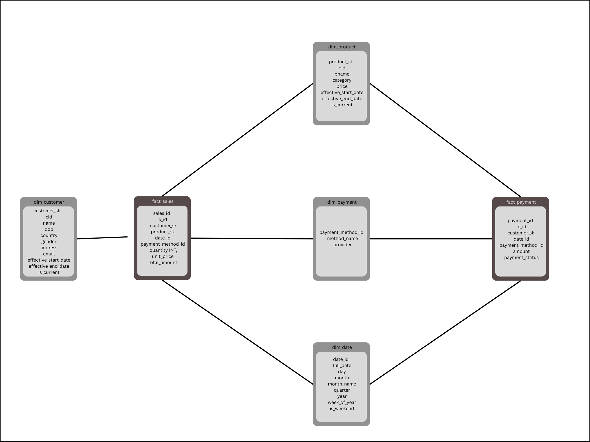

# E-commerce Data Pipeline

An end to end data pipeline that demonstrates the flow of data from source to analytics for e-commerce use case.

##  Tech Stack

- **Languages**: Python 3.9+
- **Database**: MySQL Workbench 8.0 (OLTP), PostgreSQL 15 (OLAP)
- **Message Broker**: Apache Kafka
- **CDC**: Debezium Connect
- **Orchestration**: Apache Airflow 2.7+
- **Visualization**: Tableau Desktop / Kafka UI
- **Containerization**: Docker & Docker Compose
- **Concepts Used:**: OOP methodology, Logging, Environmental variables, Exception Handling, ETL pipelines
## Project Structure

```text
.
├── airflow/              # Airflow DAGs and configuration
├── generator/            # Synthetic data generation logic
├── processor/            # ETL processing and bulk backfill scripts
├── reporting/            # Dashboard (matplotlib - trial)
├── sql/                  # Database schemas and DDL scripts
├── utils/                # Shared utilities (DB connectors, Debezium, etc.)
├── docker-compose.yml    # Infrastructure orchestration
└── requirements.txt      # Python dependencies
```

##  Architecture Overview

(2).png>)

- **Data Ingestion Layer**: Fake data is generated using Faker library and stored in CSV files. These files contain raw data which is loaded into SQL Workbench (OLTP).

- **CDC & Streaming Layer**: Debezium Connect (acts as producer) captures changes from MySQL and publishes them to Kafka topics.

- **Stream Processing Layer**: Airflow orchestrates the ETL process. It uses Kafka Extractor to extract data from Kafka, CDCTransformer to transform data, and PostgresLoader to load data into PostgreSQL.

- **Data Warehouse**: PostgreSQL(OLAP) is used as data warehouse and analytics uses the data stored here.

- **Visualization**: Tableau Desktop is used to view analytics via a dashboard.

## Postgres Schema


## Setup & Installation

### 1. Prerequisites
- Docker and Docker Compose installed.
- Python 3.9+ for local utility execution (optional).

### 2. Environment Configuration
Create a `.env` file in the root directory based on the following template (ensure these match your local environment):

```env
MYSQL_ROOT_PASSWORD=password
MYSQL_DATABASE=ecommerce
MYSQL_USER=user
MYSQL_PASSWORD=password
MYSQL_HOST=mysql
MYSQL_PORT=3306

POSTGRES_USER=username
POSTGRES_PASSWORD=password
POSTGRES_DB=ecommerce_olap
POSTGRES_HOST=postgres
POSTGRES_PORT=5432
POSTGRES_DSN=url

KAFKA_BOOTSTRAP_SERVERS=kafka:9092
DEBEZIUM_URL=http://debezium:8083
```

### 3. Start Infrastructure
Run the following command to bring up the entire stack:

```bash
docker-compose up -d
```

## Running the Pipeline

### Bulk Backfill 
To populate the system with 2 years of historical data efficiently, bypass Kafka and use the unified backfill script. This script initializes schemas and loads data directly into both MySQL and PostgreSQL.

```bash
# From within the airflow container or a local environment with dependencies
python processor/bulk_backfill.py 730
```

### Daily CDC and ETL
1. Access the Airflow UI at `http://localhost:8880` (Default: admin/admin).
2. The `ecommerce_etl_pipeline` DAG will automatically pick up changes from MySQL captured by Debezium and move them to PostgreSQL.

## Monitoring & Visualization

- **Airflow**: `http://localhost:8880` - Orchestration and DAG status.
- **Kafka UI**: `http://localhost:8081` - Monitor topics, consumer groups, and message counts.
- **Debezium Status**: `http://localhost:8383` - Check connector health and CDC events.
- **Tableau**: Connect to the PostgreSQL database (`localhost:5433`) to view the interactive dashboard.

## Future Enhancements

-  Use FastAPI to simulate user actions.
- Create a table in SQL workbench to capture changes made to OLTP and another table to store Kafka consumer messages. Verify if the data in both tables is same for a certain interval of time. (Reconcilation if Debizium or Kafka don't properly work)
- Run Kafka consumer in real time to process messages as they arrive and ETL batch wise at a certain interval of time.
- Generate XML reports for enterprises and store them in MongoDB.
- Create and test using unit tests.
